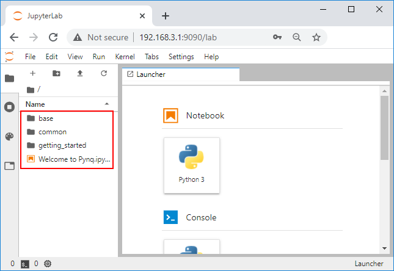

# Getting started with your PYNQ-ZU

This guide will show you how to setup your computer and PYNQ-ZU board using PYNQ. 

### Prerequisites

* PYNQ-ZU board
* Micro SD card (8GB or more recommended)
* Micro USB 3.0 Cable
* Power supply for PYNQ-ZU board
* Optional: Micro USB cable (for serial terminal)

## Setup video

You can watch the getting started video guide, or follow the instructions below.

<iframe width="560" height="315" src="https://www.youtube.com/embed/7ZcEtYGxKao" frameborder="0" allow="accelerometer; autoplay; clipboard-write; encrypted-media; gyroscope; picture-in-picture" allowfullscreen></iframe>

## Setup instructions

### Prepare a Micro SD card

* Download the [PYNQ-ZU v2.6 PYNQ image]() and write the image to a Micro SD card

### Setup the board

1. Insert the Micro SD card (pre-loaded with the PYNQ-ZU image) 

2. Connect a Micro USB 3.0 cable to the board and your computer, and plug in the power cable

3. Set the Switch to the **SD** position to boot from the SD card

4. Power on the board

### PYNQ Boot sequence

After you setup and power on the board, you should see the following sequence represented in the animated image, and described below.

1. Status LEDs will turn on. Check the the "**12V-PG**" LED turns on. This indicates the board is getting power. You will also see one of the white LEDs (PS-LED0) flash in a "heartbeat" pattern. This is a good indication the board is alive and the boot is in progress. 
2. After about 40 seconds, you should see the "**DONE**" LED turn on. This is the FPGA done signal, and indicates a bitstream has been downloaded. 
3. A few seconds later, the PYNQ image will flash the 4 white *user LEDs* (LED0-LED3), and the 2 RGB LEDs (LEDRGB0 and LEDRGB1) will flash blue to indicate the board is ready.

See the [Troubleshooting section](./support.md#troubleshooting) for issues.

#### Connect to the board

* On your computer, open a web browser (Chrome/Safari/Firefox [check Jupyter Notebook supported browsers](https://jupyter-notebook.readthedocs.io/en/stable/notebook.html#browser-compatibility)), and browse to [http://192.168.3.1/lab](http://192.168.3.1/lab)

This should bring you to the Jupyter log in screen.

​	

* Enter **xilinx** as the password

This should bring you to the Jupyter home area where you can start to explore your board with the getting started notebooks. 

 	

