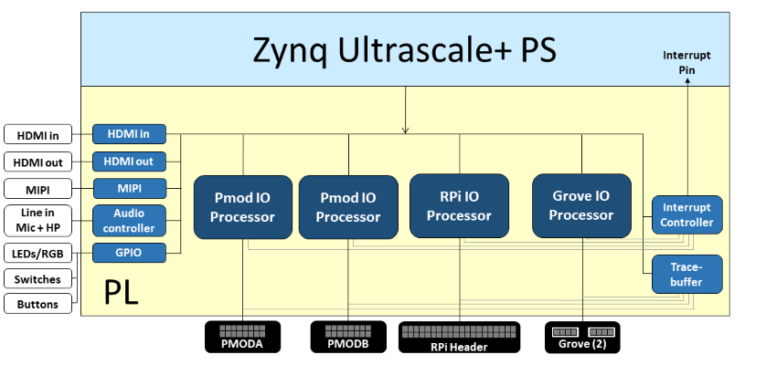
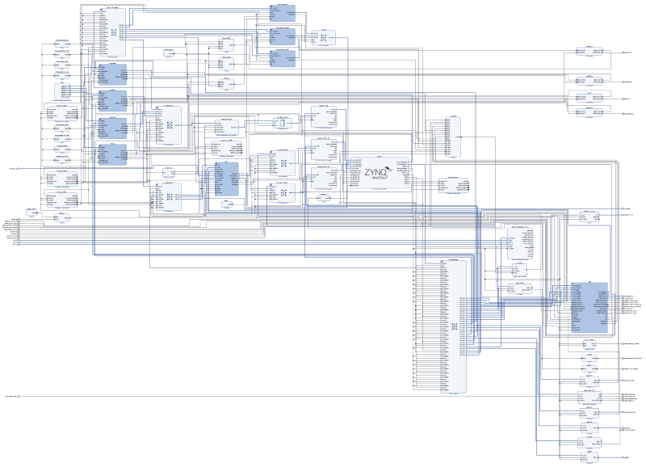

# PYNQ-ZU Base overlay

The `base` overlay is included in the PYNQ image for the PYNQ-ZU board. The purpose of the base overlay design is to allow PYNQ to use peripherals on a
board out-of-the-box. The design includes hardware IP to control peripherals on
the target board, and connects these IP blocks to the Zynq PS. 

## PYNQ-ZU Block Diagram



The base overlay on PYNQ-PU includes IP to connect to the following hardware:

* HDMI (Input and Output)
* MIPI IP 
* Audio codec
* User LEDs, Switches, Pushbuttons
* 2x Pmod PYNQ MicroBlaze
* RPi (Raspberry Pi) PYNQ MicroBlaze
* 1x Grove MicroBlaze (connected to 2x Grove)
* 3x Trace Analyzer (PMODA, PMODB, RASPBERRYPI)

Note that the Mini DisplayPort is connected to the PS, and is not part of the *base* overlay. The SYZYGY interfaces are connected to the PL, but they are not not connected in the *base* overlay. 

## Video 

Example notebooks are included in the `<Jupyter Dashboard>/base/video` directory on the board and show how to use the HDMI and MIPI interfaces. 

### HDMI

The PYNQ-ZU has dual-stacked HDMI in and HDMI out ports. The HDMI interfaces are connected to a HDMI PHY that supports up to 4K resolutions. 

The HDMI IP is connected to PS DRAM. Video can be streamed from the HDMI *in* to memory, and from memory to HDMI *out*. This allows processing of
video data from python, or writing an image or Video stream from Python to the HDMI out.

Note that while Jupyter notebook supports embedded video, video captured from the HDMI will be in raw format and would not be suitable for playback in a notebook without appropriate encoding.

#### HDMI In

The HDMI in IP can capture standard HDMI resolutions. After a HDMI source has
been connected, and the HDMI controller for the IP is started, it will
automatically detect the incoming data. The resolution can be read from the HDMI
Python class, and the image data can be streamed to the PS DRAM.

#### HDMI Out

The HDMI out IP supports the following resolutions:

* 640x480  
* 800x600 
* 1280x720 (720p)
* 1280x1024
* 1920x1080 (1080p)

Data can be streamed from the PS DRAM to the HDMI output. The HDMI Out
controller contains framebuffers to allow for smooth display of video data.

### MIPI

The PYNQ-ZU has a MIPI (Mobile Industry Processor Interface) CSI (Camera Serial Interface) which is connected to a MIPI subsystem in the base overlay. 

### DisplayPort

The PYNQ-ZU has a DisplayPort output which is connected to the PS which means that it is always available. It is not part of the *Base* overlay, but it can be used with the other interfaces and IP that are in the base overlay. 

## Audio

The PYNQ-ZU base overlay supports line in, and Headphones out/Mic. The audio
source can be selected, either line-in or Mic, and the audio in to the board
can be either recorded to file, or played out on the headphone output. 

## User IO

The PYNQ-ZU board includes two tri-color LEDs, 4 switches, 4 user push buttons connected to the PL (BTN0-BTN3), and 4 (white) user LEDs (LED0-LED3). These IO are connected directly to Zynq PL pins. 

### IOPs

For more information see the [PYNQ IOP documentation](https://pynq.readthedocs.io/en/latest/pynq_libraries.html#pynq-iops) and the [PYNQ MicroBlaze documentation](https://pynq.readthedocs.io/en/latest/pynq_libraries.html#pynqmicroblaze).

### Trace Analyzer

Trace analyzer blocks are connected to the interface pins for the two Pmod PYNQ MicroBlaze processors, and the RPi PYNQ MicroBlaze. The trace analyzer can capture IO signals and stream the data to the PS DRAM for analysis in the Python environment.

See the example notebook in the ``<Jupyter Dashboard>/base/trace`` 
directory on the board.

## Python API

The Python API for the peripherals in the base overlay is covered in 
[pynq libraries](https://pynq.readthedocs.io/en/latest/pynq_libraries.html). Example notebooks are also provided on the board to show how to use the base overlay.

## Rebuild the base overlay

The following steps describe how to rebuild the *base* overlay. You need to use *Vivado 2020.2* to run these steps. It will not work with other versions of Vivado. As the precompiled design is already available in the PYNQ image for the board, you only need to do this if you want to study the design, or make a modification.

### Get the source code

* Download or clone a copy of this repository

### Add ZU board files to Vivado

Run the following Tcl commands in Vivado to download the latest PYNQ-ZU board files from the Xilinx board repository:

```console
xhub::refresh_catalog [xhub::get_xstores xilinx_board_store]
xhub::install [xhub::get_xitems "tul.com.tw:xilinx_board_store:pynqzu:1.1"]
```

## Build the HLS IP and the create the project

Some IP for the base design are provided as HLS files. The source is available in this repository. A Tcl script is provided to compile the source files (using Vivado HLS) and export them in IP-XACT format so that they can be used in Vivado.

* Open Vivado, change (`cd`) into the `base` directory, and run the following commands in this order to build the HLS IP, and to create a Vivado project and build the block diagram for the base overlay:

```console
source ./build_ip.tcl
source ./base.tcl
```

The first command builds HLS IP for this design, and the second command builds the IP Integrator system diagram for the base overlay. 

The base overlay is a complicated design with a large number of IP blocks. The image below shows a view of the base design. You can click on this image to see a PDF version of the block design. This picture is only intending to show you a top level view of the level of complexity in the design, and not the detail of every IP. If you would like to explore the design in more detail, you can rebuild the design to this point, and check individual IP, and open various IP subsystems. 

[](./pdf/zu_base.pdf)

You can run the following commands to rebuilt the bitstream.
```
source ./build_bitstream.tcl
```

You can now review the block diagram.

Remember the precompiled bitstream is already loaded on your board, so you do not need to rebuild the bitstream unless you have changed something in the design. 

---------------------------------------
<p class="copyright">Copyright&copy; 2022 Advanced Micro Devices</p>