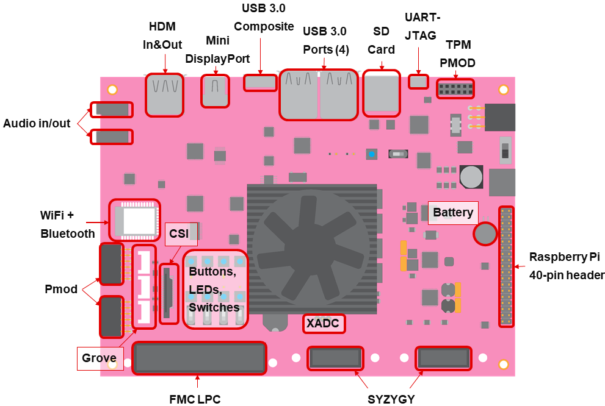
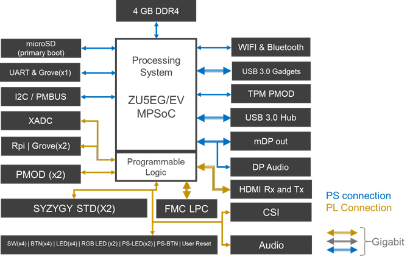

# Board overview

The board has the following features and interface:

* Zynq Ultrascale+ XCZU5EG-SFVC784
* 4GB DDR4
* Mini Display port
* HDMI In and HDMI Out
* USB 3.0  Composite device (Micro USB 3.0 port)
* 4x USB 3.0 hub
* WiFi + Bluetooth
* FMC LPC
* Dual SYZYGY interfaces
* Audio codec
* Camera Serial Interface (CSI)
* 40-pin Raspberry Pi connector, 3x Grove, 3x Pmod, XADC, 4x Switches, 4x User pushbuttons, 4x LEDs, 2x RGB LEDs   

## PYNQ-ZU board features and interfaces

## Block Diagram

## PS/PL connections

### Zynq UltraScale+ MPSoC device

The PYNQ-ZU has a Zynq Ultrascale+ XCZU5EG-SFVC784 with an ARM Cortex A53 Processing System (PS) and Xilinx Ultrascale+ Programmable Logic (PL). Peripherals are connected to PS and PL as follows:

### PS connected

* 4GB DDR4
* Micro SD card port
* Mini Display port
* WiFi + Bluetooth
* 2x 2-Stacked USB 3.0 hub
* USB 3.0  Composite device (Micro USB 3.0 port)
* TPM Pmod
* I2C/PMBus
* UART
* Grove (1)

### PL connected

* HDMI In and HDMI Out
* Audio codec
* FMC LPC
* Dual SYZYGY interfaces
* 40-pin Raspberry Pi connector
* Grove (2)
* Pmod (2)
* CSI
* XADC
* 4x Switches, 4x User pushbuttons, 4x LEDs, 2x RGB LEDs   

